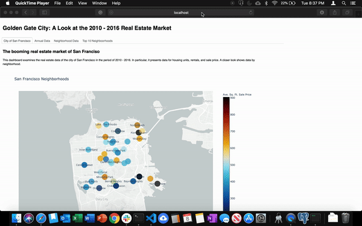

# San Francisco Real Estate Dashboard
## Guide for Users and Dashboard Administrator

### Overview

### User Guide
The dashboard consists of four tabs each showing different analysis of the real estate market of the city of San Francisco.

1. **City of San Francisco** provides overview of the real estate market with a map of San Francisco neighborhoods
2. **Annual Data** presents an analysis of the overall market trend
3. **Neighborhood Data** examines the real estate market trend by neighborhood
4. **Top 10 Neighborhoods** provides a closer look of the ten most expensive neighborhoods

#### **Tab 1: City of San Francisco**
The map plots the neighborhoods of San Francisco showing data points for each neighborhood.

Hover over the dots to see the neighborhood's:
* average number of housing units
* average gross rent
* average square foot sales price
* location points (latitude and longitude)

The size of the dots is proportional to the average number of housing units relative to the entire market

The color is determined by average sales price per square foot. See color scale on the right.

#### **Tab 2: Annual Data**

This tab presents data for housing units, rentals, and sale price from 2010 - 2016.

#### **Tab 3: Neighborhood Data**

This tab provides the same data as the annual data showing an analysis at the neighborhood level.

The chart to the right is interactive showing the average sales price historical data per neighborhood. Use the dropdown to select a neighborhood of interest.

The charts on the bottom are charts for each of the key real estate variables with overlayed per-neighborhood data.

On top or side of each chart, including charts in the next tab, you'll find a set of interactive tools which include pan, zoom, lasso select, save image, etc. You can also use the reset icon to reset the chart to its original position.

#### **Tab 4: Top 10 Neighborhoods**

This tab shows a closer look of the top 10 most expensive neighborhoods. It shows three charts.

#### Bar Chart

Simple interactive bar chart. Hover on each bar and see the data for each neighborhood. Notice how the bar changes color when you hover.

#### Parallel Coordinates

This a chart showing how each real estate variable relate to each other. You can re-order the axes to easily compare variables. You can also draw a line along the axis to highlight the line charts within the range of the line drawn.

#### Parallel Categories

Similar to the paralllel coordinates, this chart shows the relationship of the variables traceable to each neighborhood (category). Both axes and categories can be rearranged to allow for easy compare.

### Data Administrator Guide

1. Run all cells in the dashboard.jpynb jupyternotebook file including the last cell which makes the dashboard servable.

2. Open a terminal session and navigate to the notebooks directory

3. Run the command `panel serve dashboard.ipynb`. Or run the run.sh file by running the command `. run.sh`.

4. Capture the URL generated by the code.

5. Enter the URL on your browser. It should now display your dashboard.

